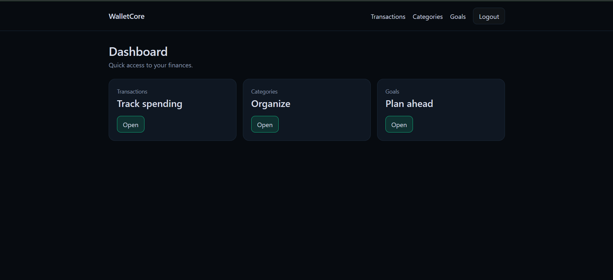
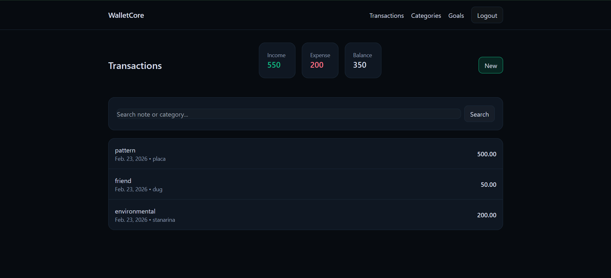
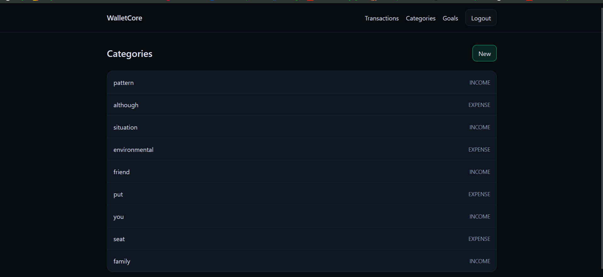
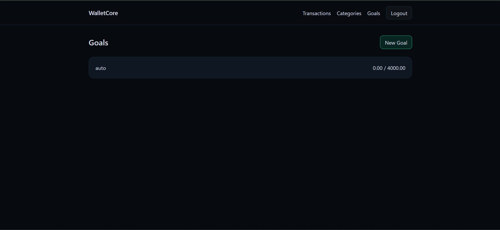
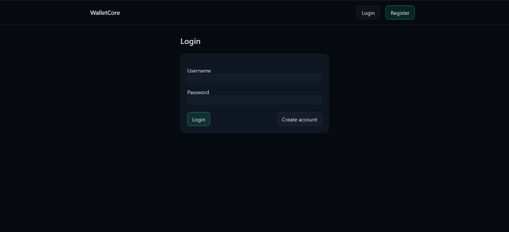
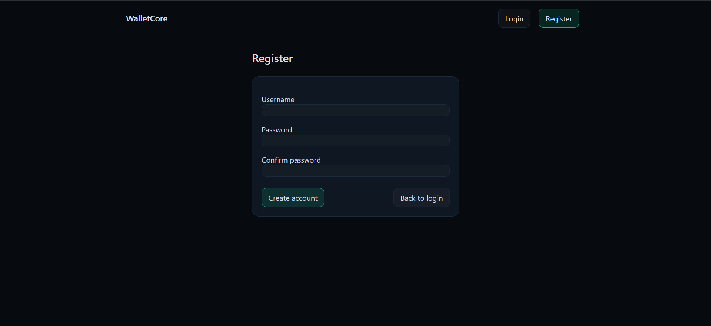

# WalletCore

Web aplikacija za upravljanje osobnim financijama razvijena u Django frameworku.

## Autori

- Ivan Pribanić  
- Karlo Lauš  

---

## Opis projekta

WalletCore omogućuje korisnicima:

- Praćenje prihoda i troškova
- Organizaciju financija po kategorijama
- Upravljanje financijskim ciljevima
- Pregled ukupnog prihoda, troška i balansa
- Sigurnu autentikaciju (registracija i prijava)

Aplikacija koristi generičke Django poglede, relacije između modela i vlastite forme.

---

## Tehnologije

- Python 3
- Django 4
- SQLite
- Tailwind (CDN)
- Django Authentication System

---

## Modeli

Aplikacija sadrži 3 glavna entiteta:

- **Category**
- **Transaction**
- **FinancialGoal**

### Relacije

- Transaction → ForeignKey → User
- Transaction → ForeignKey → Category
- FinancialGoal → ForeignKey → User

---

## Funkcionalnosti

### CRUD operacije
- Kreiranje, pregled, ažuriranje i brisanje:
  - Transakcija
  - Kategorija
  - Financijskih ciljeva

### Autentikacija
- Registracija
- Login
- Logout
- Pristup podacima samo vlastitog korisnika

### Dodatno
- Pretraga transakcija
- Automatski izračun:
  - Ukupni prihodi
  - Ukupni troškovi
  - Trenutni balans

---

## Testovi

Projekt sadrži testove koji provjeravaju:

- Pristup bez prijave (redirect)
- Ograničeni pristup tuđim podacima
- Automatsko vezanje korisnika pri kreiranju objekata
- Ispravnost modela

Pokretanje testova:

```bash
python manage.py test
```

---

## Pokretanje projekta

1. Klonirati repozitorij:

```bash
git clone https://github.com/ivantf2/WalletCore.git
cd WalletCore
```

2. Instalirati ovisnosti:

```bash
pip install -r requirements.txt
```

3. Primijeniti migracije:

```bash
python manage.py migrate
```

4. (Opcionalno) Generirati testne podatke:

```bash
python manage.py seed
```

5. Pokrenuti server:

```bash
python manage.py runserver
```

Otvoriti u pregledniku:

```
http://127.0.0.1:8000/
```

---

## Screenshots

Screenshots aplikacije dostupni su u folderu:

📁 [screenshots](./screenshots)

### Dashboard


### Transactions


### Categories


### Goals


### Login


### Register


---

## Struktura projekta

```
WalletCore/
    manage.py
    WalletCore/
    finances/
    templates/
    screenshots/
    requirements.txt
    README.md
```

---

## Zaključak

WalletCore demonstrira rad s Django modelima, relacijama, autentikacijom,
generičkim pogledima, formama i testiranjem unutar web aplikacije.